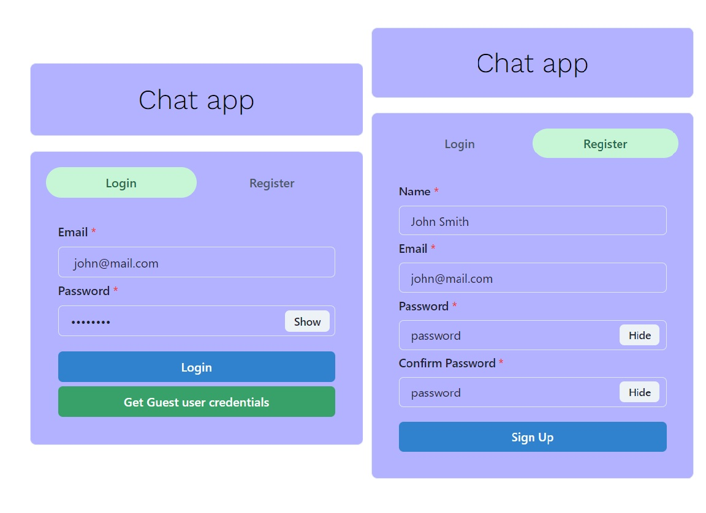
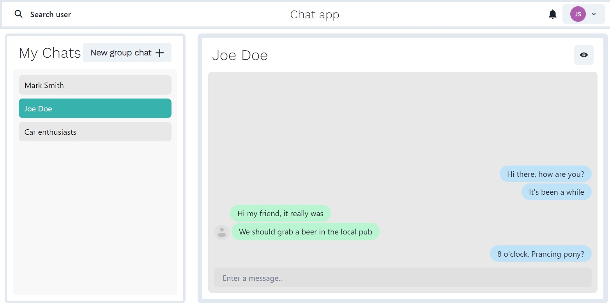
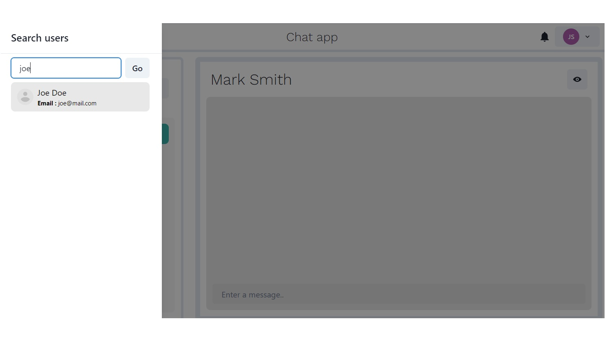
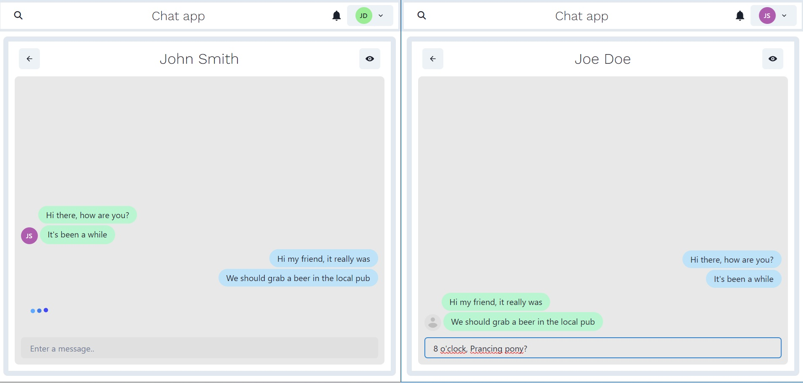
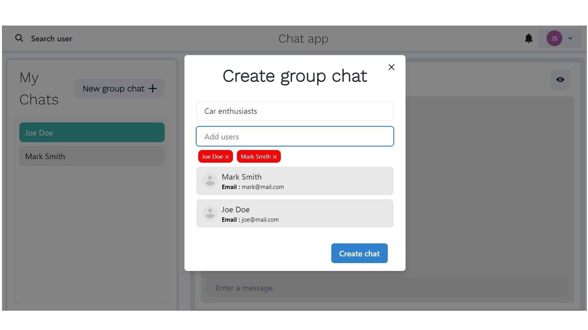
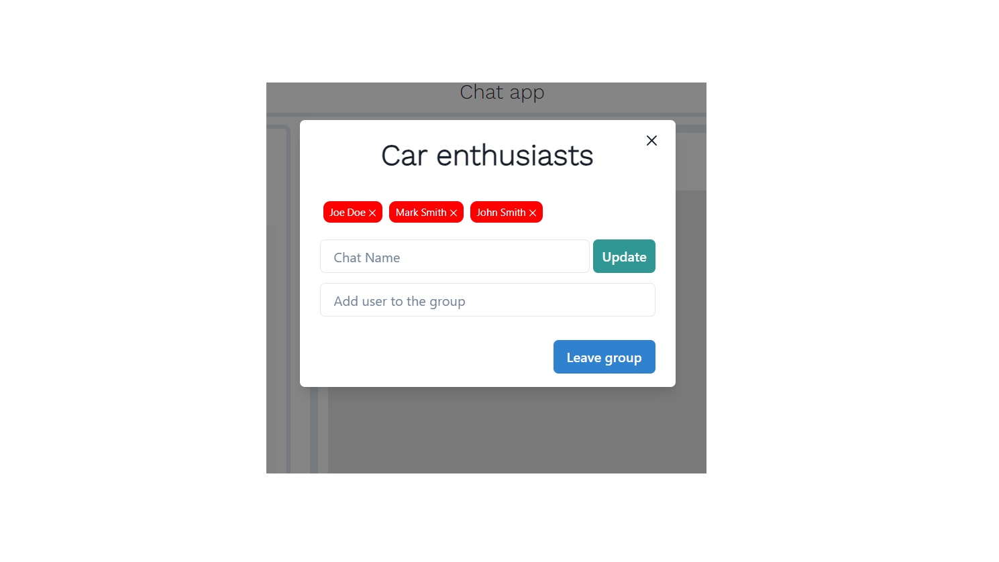
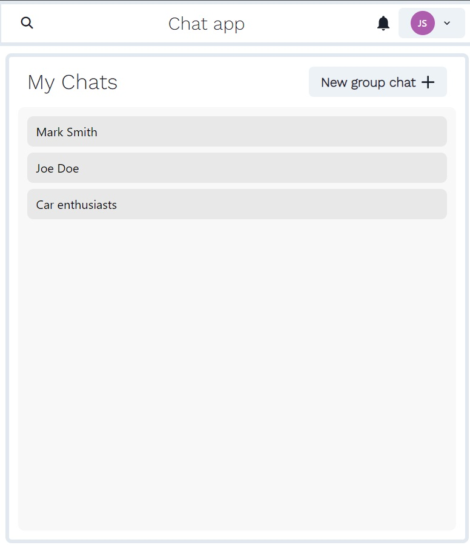
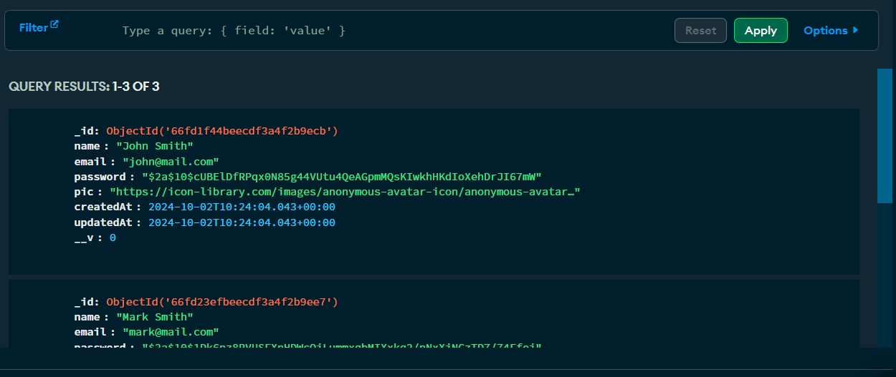

# Chat App

This is a MERN stack application with authentication (login, register) functionality,
using MongoDB as its database for storing users and chats details in encrypted format.
Socket.io is used for real time communication and Postman for testing API's we've created.

## Run locally
---

Clone the project
- git clone https://github.com/janbezovsek/chatApp.git

Go to the project directory and install npm packages
in client and server folders 
- cd client/npm install
- cd server/npm install

Start the server (localhost:5000)
- open new terminal
- cd server/npm start (we are using nodemon for automatic restart of the server)

Start the client (localhost:3000)
- open new terminal
- cd client/npm run dev

---

## App explained
---

